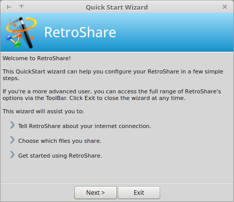
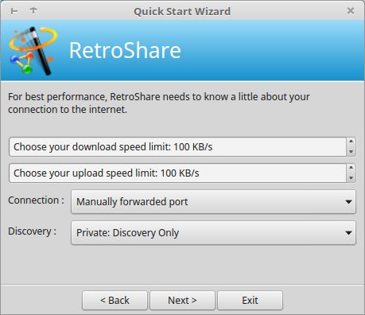
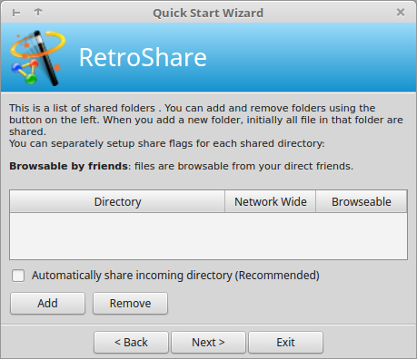
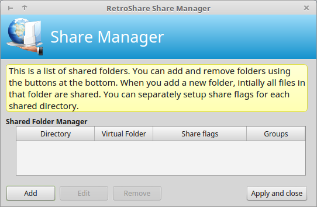
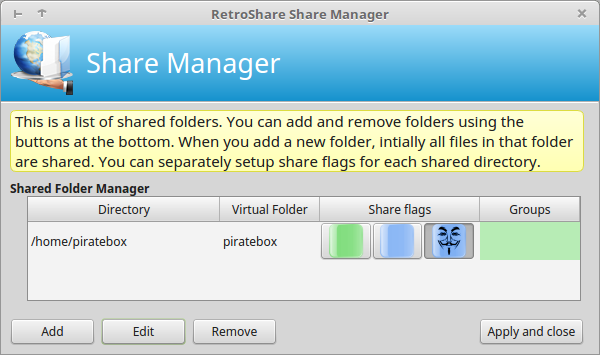

#Settings

##General
  
###Startup
 - Start minimized  
Starts RetroShare directly to the Systray into the background.  
###For Advanced Users
 - Enable Advanced Mode (Restart required)  
Enables Advanced Settings which are hidden by default. 
###Misc
 - Do not show the Quit RetroShare Messagebox  
 
 - Minimize to Tray Icon  
 - Auto Login  
When RetroShare is started the next time, it bypassed the question to select the User. And just starts with the actually used one.  
 - Use Local Server to get new arguments  
This enables to open RetroShare links from external programs, for example if you click on a link in your Browser (e.g. Firefox ). 
###Idle
 - Idle Time (default 300s)  
The Status switches to "away" after not using the computer for 5 minutes.  
  

###Launch Startup Wizard
  
This QuickStart wizard can help you to configure your RetroShare in a few simple steps.  
If you are a more advanced user, you can access the full range of RetroShare Settings via the ToolBar.  

  
This wizard will assist you to:  

 - Tell RetroShare about your internet connection  
 - Choose which files you share  
 - Get started using RetroShare  

  
For best performance, RetroShare needs to know a little about your connection to the internet.  
For detailed explanation of network settings click [here](settings/#network). 

  
This is a list of shared folders. You can add and remove folders using the button on the left. When you add a new folder, initially all files in that folders shared.  
You can separately setup share flags for each shared directory: 
For detailed explanation of shared directories click [here](settings/#directories). 

##Network
  
###Network Configuration

####Network Mode  
  

 - Public: DHT & Discovery  
   both combined  
 - Private: Discovery  
   The Discovery service sends node name and ids of your trusted contacts to connected peers, to help them choose new friends. The friendship is never automatic however, and both peers still need to trust each other to allow connection. 
   If you want to connect to a friend, but the IP and the port of your friend has changed since your last connection, it's possible to find out the new IP+Port via Discovery. A mutual friend can tell each other your new changed IP so you can connect again. 
 - Inverted: DHT
   The DHT allows you to answer connection requests from your friends using BitTorrent's DHT. It greatly improves the connectivity. No information is actually stored in the DHT. It is only used as a proxy system to get in touch with other RetroShare nodes. 
 - DarkNet: None  
   This is used if neither DHT nor Discovery is wanted. Tor and I2P hidden nodes use this by default as they already have a fixed address to connect to. 

####Nat
  

 - Automatic (UPnP)
   The UPnP (Universal Plug and Play) protocol is supported by most home adsl/cable routers. With UPnP RetroShare can open itself a port at the Router to be able to listen for incoming connections.
 - Firewalled
   Lorem Ipsum
 - Manually Forwarded Port
   In your Home Router is normally an option to open Ports on their firewall. This allow others to reach your Node from the Internet. 

####Local Address  
 - Displays your Local LAN Address, for example: 192.168.1.55
 - Internal Port on your RetroShare Node. Acceptable Port Range from 10 to 65335. Normally Ports below 1024 are reserved by your system. If possible, keep internal and external Port the same. 

####External Address  
 - Displays the external address, your public IPv4. 
 - External Port. The port where your Router is Port Forwarding to your RetroShare Node. Acceptable Port Range from 10 to 65335. Normally Ports below 1024 are reserved by your system. 

####Dynamic DNS  
 - Dynamic DNS (DDNS or DynDNS) is a method of automatically updating a domain for non-static IP addresses. The router can update the DynDNS Provider everytime the external IP Address has changed. And Point the Domain back to your IP.  
   To Set up DynDNS at your router check [openwrt.org/wiki/DDNS](https://wiki.openwrt.org/doc/howto/ddns.client?s[]=dyndns) or [dd-wrt.com/wiki/DDNS](https://www.dd-wrt.com/wiki/index.php/DDNS). Other proprietary Router Operating Systems have similar options for DynDNS. 
   [https://freedns.afraid.org/](https://freedns.afraid.org/) is a DynDNS Provider which can be used among many others.  

####Download Limit (KB/s)
Set the maximum traffic speed RetroShare can utilize for download. Measured in KiloBytes per second. 1 Mbit/s == 125 kByte/s

####Upload Limit (KB/s)
Set the maximum traffic speed RetroShare can download for upload. Measured in KiloBytes per second. 1 Mbit/s == 125 kByte/s

####Known / Previous IP's
RetroShare remembers the last 4 used internal and the last 4 used external IP's. 
This list can be cleared. 

####Show Discovery information in statusbar
Displays Information about the Discovery Service when Information is received or sent to or from friends. 

####Allow RetroShare to ask my ip to these websites
RetroShare ask's a few Websites to determin it's external IP address. 

###IP filtering
####activate IP filtering
RetroShare can block unwanted IP addresses which seem to be malicious. 
####IP blacklist  
####IP whitelist
####Ban every IP reported by your friends
####Ban every masquerading IP reported by your DHT
####Automatically ban ranges of DHT masquerading IP's starting at 
####Manual input
You can insert manually IP ranges to be banned or to be whitelisted. 

###Hidden Service Configuration
####Outgoing Connections  

 - Tor Socks Proxy  
   This is usually 127.0.0.1/localhost and port 9050. The green light shows if outgoing connections through the proxy seem to work. 
 - I2P Socks Proxy  
   This is usually 127.0.0.1/localhost and port 4447. 
   
You can connect to Hidden Nodes, even if you are running a standard Node, so why not setup Tor and/or I2P?

##File Transfer
  

RetroShare is capable of transferring data and search requests between peers that are not necessarily friends. This traffic however only transits through a connected list of friends and is anonymous.

You can separately setup share flags for each shared directory in the shared files dialog to be:  
 - **Browsable by friends**: files are seen by your friends.  
 - **Anonymously shared: files** are anonymously reachable through distant F2F tunnels.  

 - Maximum simultaneous download  
   How many downloads are allowed at the same time.  
 - Default chunk strategy  
  
    - **Streaming** causes the transfer to request 1MB file chunks in increasing order, faciliating preview while downloading.
    - **Random** is purely random and favors swarming behaviour. 
    - **Progressive** is a compromise, selecting the next chunk at random within less than 50 MB after the end of the partial file. That allows some randomness while preventing large empty file initialization times.  

 - Safety disk space limit  
   RetroShare will suspend all transfers and config file saving if the disk space goes below this limit. That prevents loss of information on some systems. A popup window will warn you when that happens. 
 - Max tunnel req. forwarded per second  
   This value controls how many tunnel requests your peer can forward per second.  
   If you have a large internet bandwidth, you may raise this up to 30-40, to allow statistically longer tunnels to pass. Be very careful though, since this generates many small packets that can significantly slow down your own file transfer.  
   The default value is 20. If you're not sure, keep it that way. 

##Relay  
  

###Enable Relay Connections
###Use Relay Servers
###Relay Options

##Directories
  

###Shared Directories
 - Edit Share  
     
   a click on *Edit Share* opens the Share Manager  
     
    - **Add** to create a new shared folder  
    - **Edit** changes permissions or directories of the share  
    - **Remove** removes the shared directory  
    - Share Folder  
      
        - Local Path  
          Set the path in your Operation System File hierarchy
        - Virtual Folder  
          Give the Share a specific name
    - Share Flags  
      By clicking on the Share Flags you can enable or disable them
        - Group Flag OFF  
            
          Browsing disabled for selected groups (Friends, Family, Co-Worker, etc...). 
        - Group Flag ON  
            
          Only direct friend nodes in selected groups can **browse** this directory.  
        - Friend Flag OFF  
            
          Disabled browsing for direct Friends. 
        - Friend Flag ON  
            
          All direct friend nodes can browse this directory.  
        - Anonymous Flag OFF  
            
          Directory is not accessible by anonymous tunnels from any Friend. No one can anonymously access this directory.  
        - Anonymous Flag ON  
            
          All friend nodes can relay anonymous tunnels to this directory. Directory is accessible by anonymous tunnels from any friend. 
 - Example Share  
      
   This directory is not browsable to groups or friends, but is shared anonymously to anyone who can reach it via anonymous tunnels. 
   
 - Automatically share incomming directory (Recommended)  
 - Auto-check shared directories every  
 - Incoming Directory  
 - Partials Directory  
 

###Plugins
  
 - Authorize all plugins
 - Plugins
 - Plugin look-up directories

##Notify
  
###Feed

###News Feed  
 - Friend Connect
 - Channels
 - Forums
 - Posted 
 - Messages
 - Chat
 - Security
 - Ip security
 - Feed Reader

###Toasters

- Disable All Toasters  

###Toasters

 - Friend Connect
 - New Message
 - Download completed
 - Private Chat
 - Group Chat
 - Chat Lobby
 - Connect attempt

###Systray

##Node
  
###Node Information

####Public Information
 - Name
 - Location
 - Location ID
 - PGP Id
 - PGP fingerprint
 
####Other information
 - Friend nodes
 - Software Version
 - Online since
  
###Certificate

##People
  
###Identities handling
 - automatically give "Positive" opinion to my contacts
 - Friend average opinion below which identities are banned: 

##Chat
  
###General
###Distant Chat
###Chat Settings
 - Enable Emoticons Privat Chat
 - Enable Emoticons Group Chat
 - Enable custom fonts
  
 - Minimum font size
 - Enable bold
 - Enable italics
 - Minimum text contrast
 - Send message with Ctrl+Return
###Chat Lobby
 - Blink tab icon
 - Default identity for chat lobbies
###History

###Style

##Message
  
###Distant messages
 - Accept encrypted distant messages from
 
###Reading 
 - Set message to read on activate
 - Load embedded images
 - open messages in

##Channels
  
###General
 - Load posts in background (Thread)
 
###Tabs
 - Open each channel in a new tab
 - Hide tabbar with one open tab

##Forum
  
###Misc
 - Set message to read on activate
 - Expand new messages
 - Load ebedded images
 
###Tabs
 - Open each forum in a new tab
 - Hide tabbar with one open tab

##Posted
  

###Tabs
 - Open each topic in a new tab
 - Hide tabbar with one open tab

##Appearance
  

###Language 
Changes to language will only take effect after restarting RetroShare!

###Style

###Stlye Sheet

###Tool Bar

###Status bar
 - Compact Mode
 - Hide Sound Status
 - Hide Toaster Disabled

##Sound
  

###Chatmessage
 - New Msg
 
###Download

###Friend

##Permissions
  

###Matrix

##Webinterface
  

 - Enable RetroShare WEB Interface
 
###Web parameters

 - Port 9090
 - allow access from all IP adresses (Default: localhost only)

Note: these settings do not affect retroshare-nogui has a command line switch to activate the webinterface

##FeedReader
  
###Network Configuration
